*This post written jointly with [JT Olds](https://medium.com/@jtolds).*

### Infectious — The Reed-Solomon Forward Error Correcting library for Go

[storj/infectious](https://github.com/storj/infectious) — Reed-Solomon forward error correcting library

Infectious is a high-performance [forward error correcting](https://en.wikipedia.org/wiki/Forward_error_correction) library for the [Go programming language](https://golang.org/). Error correcting codes in general are widely used for reliability and resilience, and even for decreasing latency and increasing throughput. [Reed-Solomon](https://en.wikipedia.org/wiki/Reed%E2%80%93Solomon_error_correction) specifically is used all the way from QR codes or barcodes to satellite communication and is why scratched CDs and DVDs still work. If you haven't guessed yet, we use Reed-Solomon, too.

Our library does something that appears to be so far unusual, or at least rare, in open-source Reed-Solomon libraries. It's why we wrote it! Not only does it reconstitute data with erasures quickly, it corrects data corruption and identifies which specific pieces of data are bad or corrupted by using the [Berlekamp-Welch algorithm](https://en.wikipedia.org/wiki/Berlekamp%E2%80%93Welch_algorithm). If this sounds completely foreign to you, don't worry! We started there, too. Keep reading and we'll explain everything.

If you use Go, you may be interested in how this helps you practically. Here's an example!

```go
f, err := infectious.NewFEC(2, 5)
if err != nil {
    panic(err)
}

// prepare to receive the encoded data
shares := make([]infectious.Share, total)
output := func(s infectious.Share) {
    shares[s.Number] = s.DeepCopy()
}

// encode the data!
err = f.Encode([]byte("hello, world! __"), output)
if err != nil {
    panic(err)
}

// some bad stuff happens
shares = shares[1:]     // drop the first piece
shares[0].Data[1] = '!' // mutate the second

// recover the data
result, err := f.Decode(nil, shares)
if err != nil {
    panic(err)
}

// we have the original data!
fmt.Printf("got: %#v\n", string(result))
```

If you want to skip straight to the full documentation, please visit http://godoc.org/github.com/storj/infectious

## A quick refresher on oversampling polynomials

Perhaps you remember from Algebra class in junior high or high school that any line is uniquely determined by two points.


You can "oversample" the line and place more points on it, but fundamentally, as long as you have any two points on the line, you have the same line.

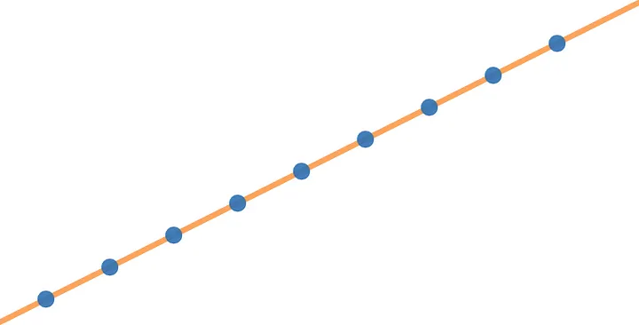

No matter which two points you choose, you will always have the same line that goes through those points.

The same sort of thing is true with polynomials of degree *n*. One could call a line a polynomial of degree 1. A degree 2 polynomial is more familiarly called a quadratic equation or parabola. A degree-3 polynomial is often called a cubic equation. What specifically do we mean by polynomial? Here are some examples of polynomials:

- *y* = *mx* + *b* (linear equation, degree 1)
- *y* = *ax*² + *bx* + *c* (quadratic equation, degree 2)
- *y* = *ax*³ + *bx*² + *cx* + *d* (cubic equation, degree 3)
- *y* = *ax*⁴ + *bx*³ + *cx*² + *dx* + *e* (quartic equation, degree 4)
- … etc.

You'll notice that the degree of the polynomial relates to the largest exponent of the variable *x* in the standard form of the equation.

Any 3 points uniquely determine a polynomial of degree 2, and any 4 points uniquely determine a polynomial of degree 3. In general, any *n*+1 points uniquely determine a polynomial of degree *n*. Some visual examples:

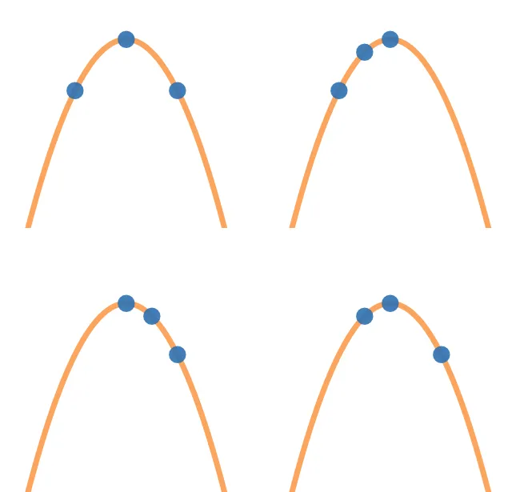

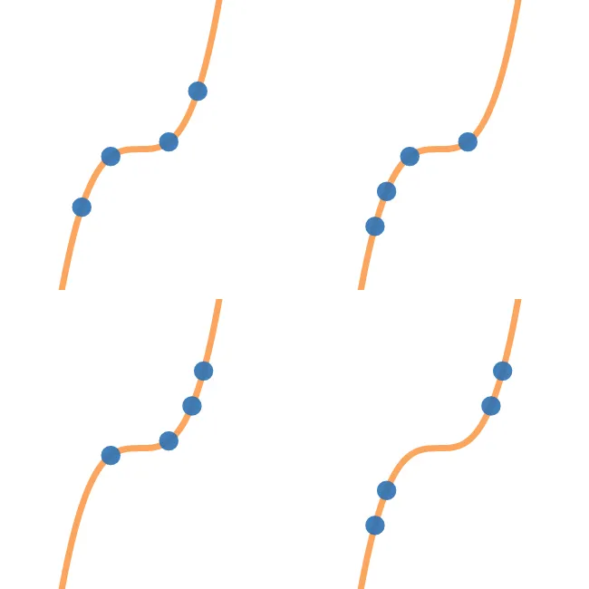

Just like with the line, you can oversample the polynomial. If you oversample a polynomial of degree 3, any 4 points can be used to reconstruct the original polynomial.


If someone gives you 4 points, you can make a unique polynomial of degree 3. You can then find 4 more points on the same polynomial. Now you have 8 unique points where all you need is any 4 of them — it doesn't matter which ones! — to construct the original polynomial.

### Constructing a large polynomial

So, at this point, you might remember how to figure out the equation for a line that goes through two points, but how do you figure out the 19th degree polynomial that goes through any 20 points? Fortunately a straightforward method for constructing the unique 19th degree polynomial through any 20 points exists! It's so cool, we couldn't help ourselves writing about it as an aside:

[Joseph Louis Lagrange and the Polynomials](https://medium.com/@jtolds/joseph-louis-lagrange-and-the-polynomials-499cf0742b39) — An aside where Jeff and I explain Lagrange polynomial interpolation.

Via Lagrange interpolation, once you have data points, you can construct the unique polynomial through those data points pretty easily!

## Wait! How is this useful?

If someone gives you a video file, an MP3, or a spreadsheet, they're giving you long strings of ones and zeros. First, let's break your Chumbawamba MP3 into 4 pieces. These are essentially four files that are 1/4th the size of your MP3.

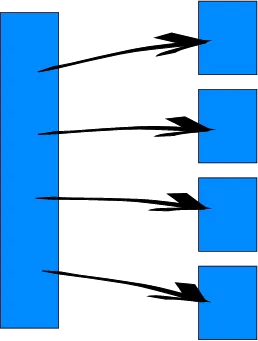

Next, since those 4 pieces are ones and zeros, we can treat them like really large numbers. Let's give these pieces *x* coordinates 0, 1, 2, and 3, and use the actual data as *y* coordinates. We will have four points, (*x*₀, *y*₀), (*x*₁, *y*₁), (*x*₂, *y*₂), and (*x*₃, *y*₃), such that:

- *x*₀ = 0, *y*₀ = the first quarter of your MP3 as a single, huge number.
- *x*₁ = 1, *y*₁ = the second quarter of your MP3. We're talking a number that takes about 1 megabyte to write down, depending on your MP3 quality.
- *x*₂ = 2, *y*₂ = the third quarter of your MP3. Big number again.
- *x*₃ = 3, *y*₃ = the last quarter of your MP3. You guessed it.

We can draw a polynomial through these 4 points! It won't look like this one necessarily, but here's a visual of a degree-3 polynomial (uniquely determined by 4 points):

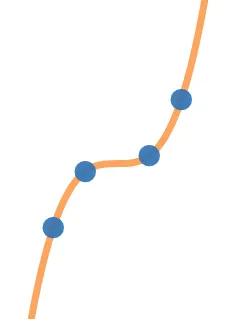

Using [Lagrange interpolation](https://medium.com/@jtolds/joseph-louis-lagrange-and-the-polynomials-499cf0742b39), we now have a function, *P*(*x*) such that:

- *P*(0) = *y*₀, the first quarter of your MP3.
- *P*(1) = *y*₁, the second quarter of your MP3.
- *P*(2) = *y*₂, yep.
- *P*(3) = *y*₃, the end of Tubthumping, by Chumbawamba.

Now, let's find the value of the polynomial at *x* coordinates 4, 5, 6, and 7, *y*₄ = *P*(4), *y*₅ = *P*(5), *y*₆ = *P*(6), and *y*₇ = *P*(7). We'll store those calculated *y* coordinates as new pieces. They'll each be about 1/4 the size of the MP3 too!

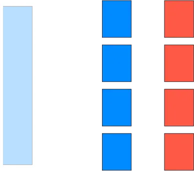

Now let's say we lose some pieces and we only have 4 remaining, (1, *y*₁), (4, *y*₄), (5 *y*₅), and (6, *y*₆).

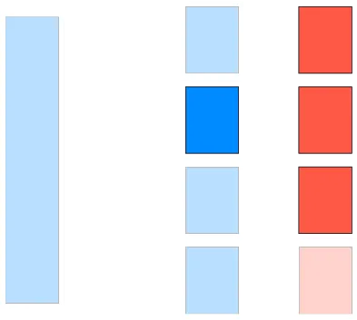

We can take those remaining 4 points and construct a degree 3 polynomial that goes through those 4 points, *P'*(*x*). Because those 4 points went through the same degree 3 polynomial we had originally, and a degree 3 polynomial that goes through 4 specific points is unique, this is the exact same polynomial. *P'*(*x*) = *P*(*x*) for all *x*! We can recompute *P*(0) = *y*₀, *P*(1) = *y*₁, *P*(2) = *y*₂, and *P*(3) = *y*₃, put them back together, and get back your MP3.

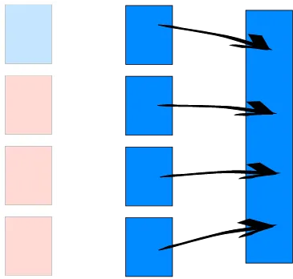

What's amazing about this is we can recover your MP3 with any 4 pieces. It doesn't matter which ones! All 8 data points are unique but any 4 of them are sufficient to recover your entire original file.

This opens the door for some unexpected benefits. When reading, you can attempt to read from all 8 pieces and return early after getting the fastest 4, reducing latency by eliminating long tails. You can also increase your throughput if each piece could not saturate your read bandwidth by itself.

To recap:

- We break your MP3 into, say, 4 numbers.
- We use those numbers as the *y* coordinates for *x* values 0, 1, 2, and 3 such that now we have 4 points, (0, `1/4 Chumbawamba data`), (1, `1/4 Chumbawamba data`), (2, `1/4 Chumbawamba data`), and (3, `1/4 Chumbawamba data`).
- We interpolate a polynomial through those points.
- We oversample the polynomial by evaluating *x* values 4, 5, 6, and 7 to get their *y* values, creating 4 more points.
- Now we have 8 unique points, where any 4 of those points will allow us to regenerate the original polynomial. We can send or store those points in an environment where there might be data loss and we lose some points. Maybe you're burning a CD for your 5 year old cousin who really likes Chumbawamba's 1997 hit, Tubthumping.
- When it's time to recover your data or play your MP3, we regenerate the original polynomial with the pieces we have, which we then can evaluate at *x* = 0, 1, 2, or 3 to get your original data. Your MP3 maybe got knocked down, but it got up again. You'd need to lose more than 4 pieces to keep it down.

This is the core idea behind Reed-Solomon. Who said polynomials were useless? Thanks, math!

## Error correction?

A lot of libraries and use cases of Reed-Solomon stop there. They'll allow you to encode your data by oversampling a polynomial and recover your data by regenerating it from points.

What happens if you find data that looks like this?

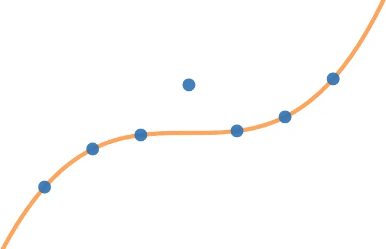

Just looking at this graph, even without the helpful orange line, you know that one of your data points is not just missing, it's still there and *wrong*. This is why Reed-Solomon is considered a *forward error correcting code*. It allows you to encode your data in such a way that you can detect errors and correct them long after you stored your data.

Some libraries might work with data like this; others might fail. Ours will not only recover the original data but allow you to determine which point was bad, given enough extra data points. This is where the Berlekamp-Welch algorithm comes in.

It is worth pointing out that there's a limit to the number of errors that can be detected based on the data you have available. For a degree 3 equation, if all you have is 4 data points, no errors can be detected. If you have 5 data points, then at best you can only detect an error, not recover from it. If you have 6 data points, then you can correct just 1 error or you can detect 2.


## Berlekamp-Welch's Great Juice

Okay, so when we stored the data, we stored multiple data points (*x*ᵢ, *y*ᵢ). Each of these points got persisted somewhere, and now perhaps some are lost, or some are corrupted. To represent that the data might be invalid or had bit flips or corruption, after time has passed we will assume that the values we have now are (*x*ᵢ, *r*ᵢ), where *r*ᵢ is not necessarily the same as the *y*ᵢ we stored.

So the set up is that we have received some possibly incorrect values *r*ᵢ, the corresponding *x* coordinates *x*ᵢ, and a limit on the number of errors we can handle *e*, based on the amount of extra points. Let's call the original polynomial we stored *P*(*x*) that goes through the (*x*ᵢ, *y*ᵢ)s and let's define an error polynomial *E*(*x*) such that *E*(*x*ᵢ) = 0 when *r*ᵢ has an error (*r*ᵢ ≠ *y*ᵢ). I know, we don't know which of the *r*ᵢ values have errors yet, but we eventually will, and we're just pulling stuff out of our hat right now.

But check this out, for every (*x*ᵢ, *r*ᵢ) pair we were able to recover, the following equivalence is true:


We'll call this the key equation. Why is it true? There's two cases:


In the first case, *r*ᵢ has an error, so by our definition of *E*(*x*), *E*(*x*ᵢ) = 0. But in the second case, then *P*(*x*ᵢ) and *r*ᵢ are the same value on both sides. So all we have to do is find this *E*(*x*) polynomial and we can divide to find out what *P*(*x*) really is! But we don't know what *E*(*x*) or *P*(*x*) are, so what do we do?

First, lets define *Q*(*x*) = *P*(*x*) *E*(*x*). Due to the previous equivalence, we also have *Q*(*x*ᵢ) = *r*ᵢ *E*(*x*ᵢ). This admittedly hasn't solved anything for us yet, but let's keep looking.

What's the degree of *P*(*x*)? Well, it has one term in the Lagrange polynomial for every point we're sampling at — the number of required points. What's the degree of *E*(*x*)? As we said before, it's based on the amount of extra points *e*. If we have two extra points, we can tolerate one error. If we have four extra points, we can tolerate two errors. In general, it's the number of extra points divided by 2, rounded down. And the degree of *Q*(*x*) is just the degree of *P*(*x*) plus the degree of *E*(*x*), since degrees add when polynomials are multiplied.

So let's consider each coefficient on the *Q* and *E* polynomials to be unknowns. How many unknowns does a polynomial of some degree *d* have? Well, a first degree polynomial (a line) looks like *ax* + *b*, so it has 2. You can probably convince yourself that the answer is *d* + 1. But we need one last trick to make the next part work: since we multiplied the equation above by *E*(*x*) on both sides, and since we can multiply any equation by a non-zero constant and not change its truth, we can just divide both sides by a number to make the largest coefficient in *E*(*x*) equal to 1, which reduces the number of unknowns in the *E* polynomial by 1. Remember, *E* just has to be equal to zero when there's an error at that point, so scaling it doesn't change that property.

So how many unknowns does each polynomial have?


And how many unknowns do we have in total?


and since the number of unknowns is less than the number of points, we can write out a linear system and solve it.

To keep things concrete, let's assume we have only 2 required points and 4 points total. Since the number of extra points is 2, *E* is a degree 1 polynomial with a leading coefficient of 1:


And since we have 2 required points, *P* is a line:


And *Q* is *P*(*x*) *E*(*x*):


We have 4 *x* coordinates, *x*₀ through *x*₃, and similarly 4 *y* coordinates, *r*₀ through *r*₃ that we received. Expanding out the key equation for some (*x*ᵢ, *r*ᵢ) pair, we get:

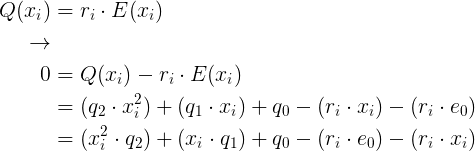

Let's write that one constraint as a vector product:


The left side of the above equation is a row vector multiplied by a column vector, and the output is a column vector of height 1. We can expand the vectors into a full matrix for all of our constraints (*x*ᵢ, *r*ᵢ) and we end up with the matrix:

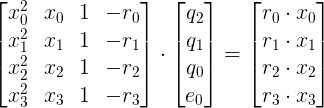

Now all we have to do is apply some standard linear algebra techniques to invert that matrix and left-multiply both sides of the equation by the inverse, giving us the coefficients for the *Q* and *E* polynomials. But what we wanted was the *P* polynomial corresponding to the original data. What do we do? Long division!

How do you divide polynomials? Just like normal numbers. Let's go through an example. Let's divide (-*x*² + 8*x* — 15) by (*x* — 2). First, we can subtract -*x* factors of (*x* — 2) from (-*x*² + 8*x* — 15), and so we subtract out (-*x*² + 2*x*) to get (6*x* — 15) (or add *x*² — 2*x*). Then we can subtract out 6 factors of (*x* — 2) from (6*x* — 15) to get -3. So our answer is (-*x* + 6) with a remainder of -3. We can write this out more expanded maybe like how you've seen normal long division done before:

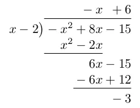

So we just have to run that algorithm on *Q* and *E* to give us our original *P*.

Once we have *P*(*x*), it's game over. We can now evaluate *P*(*x*) for all the *x*ᵢ coordinates and recover the original *y*ᵢ values. As soon as we have the *y*ᵢ values, we can compare them to the *r*ᵢ values we have and determine which data pieces went bad.

We're done!

## How do I use Infectious?

First, you want to import it!

```go
import (
    "github.com/storj/infectious"
)
```

Then, you'll want to create a `*FEC` object.

```go
const (
    required = 4
    total    = 8
)

// Create a *FEC, which will require 'required' pieces
// for reconstruction at minimum, and generate 'total'
// total pieces.
f, err := infectious.NewFEC(required, total)
if err != nil {
    panic(err)
}
```

The `*FEC` object will keep track of your Reed-Solomon configuration, namely the number of required pieces to construct a unique polynomial, and the number of total pieces (required + oversampled). The `*FEC` object `f` will allow you to take data and break it up into `total` pieces where you only need `required` many, it will let you recover your original data from those pieces, and it will allow you to detect errors in the pieces.

### Encoding

The signature for encoding looks like this:

```go
func (f *FEC) Encode(input []byte, output func(Share)) error
```

Here, a `Share` is this structure:

```go
type Share struct {
    Number int
    Data   []byte
}
```

`Number` is essentially the polynomial's *x* coordinate, and `Data` is essentially the *y* coordinate.

`Encode` is going to take your input data and call `output` with `total` amount of `Share`s, where you only need `required` amount of `Share`s to recover your data. Here's an example:

```go
// Prepare to receive the shares of encoded data.
shares := make([]infectious.Share, total)
output := func(s infectious.Share) {
    // we need to make a copy of the data. The share data
    // memory gets reused when we return.
    shares[s.Number] = s.DeepCopy()
}

// the data to encode must be padded to a multiple of 'required',
// hence the underscores.
err = f.Encode([]byte("hello, world! __"), output)
if err != nil {
    return err
}
```

Now that you have this list of `Share` objects, feel free to serialize them, send them across a network, burn them to a CD, or persist them how you like. You'll need to keep track of the share `Number` and the corresponding `Data` together.

### Decoding

Decoding is straightforward once you have your `Share` objects again.

```go
shares := getShares(ctx)
data, err := f.Decode(nil, shares)
if err != nil {
    return err
}
```

Tada! `data` contains the original `"hello world! __"` value we encoded with.

### Finding errors

What if you want to find which pieces had errors? For that, you'll want to hang on to the pieces you have, use the `Correct` method, and then compare and see what changed. `Correct` is called for you when you call `Decode`, and some Reed-Solomon libraries don't provide this feature.

```go
originals := map[int]infectious.Share{}
for _, share := range shares {
    originals[share.Number] = share.DeepCopy()
}

err := f.Correct(shares)
if err != nil {
    return err
}

for _, share := range shares {
    if !bytes.Equal(originals[share.Number].Data, share.Data) {
        fmt.Printf("share %d changed!\n", share.Number)
    }
}
```

For more information, be sure to check out our complete documentation at http://godoc.org/github.com/storj/infectious

## What's next?

We've explained encoding, decoding, and error correction, but if you were to implement them as we've explained them, they're very slow. Many of the intermediate results of the algorithm described above will be fractional numbers, and not integers! Arbitrary precision rational math is not something computers are good at (especially when doing matrix inversion, polynomial division, and interpolation), so to gain speed, you'll need to use [Galois Fields and finite math](https://en.wikipedia.org/wiki/Finite_field); it's what Infectious uses.

